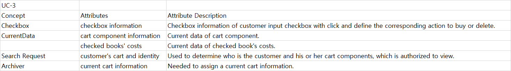

# README.md

# UC-1: Prepare Payment
## Extracting the Responsibilities

## Extracting the Associations

## Extracting the Attributes

# UC-2: Payment Process
## Extracting the Responsibilities

## Extracting the Associations

## Extracting the Attributes

# UC-3: Cart
## Extracting the Responsibilities

## Extracting the Associations

## Extracting the Attributes

# UC-4: Manage Purchase history and state
## Extracting the Responsibilities

## Extracting the Associations

## Extracting the Attributes

# UC-5: Manage Point
## Extracting the Responsibilities

## Extracting the Associations

## Extracting the Attributes

# UC-6: Confirm Expenditure
## Extracting the Responsibilities

## Extracting the Associations

## Extracting the Attributes

