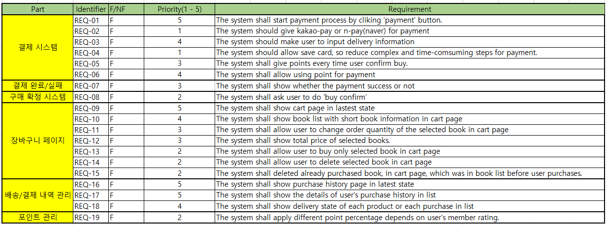

# gojangnan aladin

# Problem Statement

## Business Goal

1. 웹사이트를 통한 온라인 도서 구매 시스템을 원한다.
2. 선택지를 줄일 수 있게 도서를 추천해준다.
3. 빠르고 편한 결제 시스템이 있어야 한다.
4. 관리자가 운영을 전반적으로 관리할 수 있어야 한다.

## The Problem

 우선적으로 각 회원들마다 맞춤형으로 도서가 추천되어야 합니다. 로그인을 하면 첫 화면서 추천도서가 뜨고, 비슷한 사용자가 구매한 책이 뜨는 겁니다. 각 도서 이미지나 제목을 클릭하면 책을 구매할 수 있어야 합니다. 또한 검색을 통해 책을 찾고 구매할 수도 있어야합니다. 검색을 하면 도서 리스트가 보이고 원하는 도서를 클릭하면 도서 정보페이지로 들어가 도서의 정보를 보고 구매할 수 있어야 합니다.    
 즉시 구매할 수도 있고 장바구니를 통해 원하는 여러 책을 장바구니에 담아 놓고, 장바구니에 있는 책을 한번에 구매할 수 있길 원합니다. 장바구니에 담아둔 책을 장바구니에서 삭제하거나 장바구니에 있는 책 중 일부만 주문할 수 있기도 해야 합나다. 결제 시스템도 있어야 합니다. 받은 책에 대해서 일정 기간내에는 반품을 할 수 있도록 반품하기 버튼도 있었으면 합니다.
 각 회원은 자기 정보를 볼 수 있어야 합니다. 기본적인 회원 정보에 회원 등급이 있었으면 합니다. 회원등급은 Blue, Silver, Gold, Diamond로 뒤로 갈 수록 높은 등급입니다. 기본적인 회원 정보는 이름, 아이디, 비밀번호, 주소, 전화번호 등 배달 시 필요한 정보들입니다.
 
 관리자는 도서, 회원, 배송 관리를 할 수 있어야 합니다. 사이트에 도서를 추가하고 삭제하고 도서의 상태를 변경할 수 있어야 합니다. 회원들이 어떤 책을 구매했는지 볼 수 있고, 회원들의 등급에 따라 혜택을 부여할 수 있도록 회원 관리 기능이 있었으면 합니다. 주문된 책을 배송해야 하니 현재 진행해야하는 주문, 진행되고 있는 주문, 완료된 주문으로 구분해서 주문을 볼 수 있어야 합니다. 각 책 별 총 매출액과 가장 잘 팔린 책 등을 기간을 설정해 볼 수 있었으면 합니다. 특정 기간의 총 매출액도 볼 수 있으면 좋겠습니다.

## Scenarios

### User scenario

책 주문을하기 위해 컴퓨터 혹은 핸드폰에서 인터넷을 켜 도서 구매 사이트로 이동합니다. 사용자는 사이트의 홈화면에서 로그인 버튼을 눌러 로그인 페이지로 이동합니다. 회원 로그인하기와 관리자 로그인하기 중 회원 로그인하기를 선택해 로그인합니다.

회원가입을 한다면 로그인 버튼을 눌러 로그인 페이지에 있는 회원가입 버튼을 통해 회원가입합니다. 회원가입은 아이디, 비밀번호, 이름, 나이, 성별, 주소, 비밀번호를 모두 입력합니다. 이후 인증이 완료된 후 가입하기 버튼을 클릭해 하면 회원가입이 완료됩니다. 로그인 후 홈 화면에서 '...님을 위한 추천 도서'를 볼 수 있습니다. 추천 도서란에 있는 도서를 클릭하면 도서 정보페이지로 이동합니다.

검색엔진을 통해 원하는 도서의 이름을 입력하면 정확도 순의 도서 목록을 볼 수 있습니다. 도서 목록은 도서 이미지, 책 제목, 저자 이름 등으로 이루어져 있습니다. 스크롤을 내리고 페이지를 넘기며 원하는 도서를 찾고 해당 도서를 찾았다면 책 이미지 혹은 책 제목을 클릭하여 도서 정보 페이지로 이동합니다.

선택된 도서의 세부 정보와 미리보기를 볼 수 있습니다. 세부 정보는 제목, 저자, ISBN, 가격, 목차, 줄거리, 출판사 등등 입니다. 또한 도서 리뷰란에서 다른 사용자들이 작성한 리뷰를 볼 수 있고, 새로운 리뷰를 작성할 수도 있습니다.

도서 정보 페이지에 있는 '즉시 구매'를 클릭하면 도서 구매 페이지로 이동합니다. '즉시 구매'가 아닌 '장바구니' 클릭 시, 도서가 장바구니에 담깁니다. 장바구니 페이지는 '장바구니 보기' 버튼을 통해 볼 수 있습니다. 장바구니 페이지로 이동하면 여태까지 장바구니 담아둔 책 리스트를 볼 수 있습니다. 구매를 원치 않게 된 도서를 장바구니 페이지에서 제거하고, 장바구니에 담긴 책 중 구매를 원하는 도서만 선택합니다. 이후 '구매하기' 버튼을 클릭하면 선택된 도서만 구매할 수 있는 구매 페이지로 이동합니다.

구매페이지에서 구매할 책 목록, 금액을 볼 수 있습니다. 구매인, 구매인 전화번호, 배송지를 입력합니다. 포인트 사용을 선택하면 최종 금액을 볼 수 있습니다. 최종 금액과 회원 등급에 따라 적립될 예상 포인트를 볼 수 있습니다. '결제하기' 버튼을 통해 결제 시스템으로 이어지며, 결제 시스템을 통해 책을 구매하게 됩니다. 구매한 책은 장바구니에서 자동 삭제 됩니다.

'내 정보' 버튼에서 회원의 정보와 구매한 책, 배송 정보 등을 볼 수 있습니다. 회원 정보란에서는 회원 가입시 입력한 정보와 회원 등급을 볼 수 있습니다. 회원 가입 시 입력한 정보는 수정할 수 있으며 비밀번호를 변경할 수도 있습니다. 구매 목록란에서는 여태까지 구매했던 모든 도서 리스트를 볼 수 있습니다. 배송 정보란에서는 구매 정보와 배송 상태를 알 수 있습니다. 배송 준비 중이면 '배송 준비 중', 배송 중이라면 '배송 중', 배송 완료되었다면 '배송 완료'로 그 상태를 알 수 있습니다.

### Admin scenario

인터넷을 켜 도서 구매 사이트로 이동합니다. 사이트의 홈 화면에서 로그인 버튼을 누릅니다. 로그인 페이지로 이동하여 회원 로그인과 관리자 로그인 중 관리자 로그인을 선택합니다. 관리자로 로그인을 하면 사이트 관리 페이지로 이동합니다.
사이트 관리 페이지에서는 도서 관리, 거래 관리, 회원 관리를 할 수 있습니다.

도서 관리 페이지에서는 사이트에 새롭게 도서를 등록하거나 등록된 도서를 삭제할 수 있습니다. 또한 등록된 도서들의 상태를 알 수 있습니다. 총 판매 권수, 환불된 책 권수, 책이 팔린 기록, 품절 혹은 절판 상태 등등을 볼 수 있습니다. 기간 별로 각 도서의 상태를 볼 수도 있으며 판매 권 수 등으로 도서 리스트를 재정렬 가능합니다. 수 많은 도서가 등록되어 있으므로 검색기능을 통해 도서를 검색할 수도 있습니다. 각 도서 상태를 변경할 수도 있습니다.

거래 관리 페이지에서는 모든 거래 기록과 모든 배송 정보를 볼 수 있습니다. 거래 기록에서는 현재까지의 총 판매액, 기간별 판매액 등을 볼 수 있습니다. 배송 정보는 세부적으로 배송 완료, 배송 중, 배송 준비 중으로 나눠지며 앞의 상태에 따라 배송 정보를 선별하여 볼 수도 있습니다. 어떤 회원이 언제 어떤 책들을 주문했으며 배송 상태가 어떠한지 볼 수 있습니다.

회원 관리 페이지에서는 모든 회원의 정보를 볼 수 있습니다. 각 회원의 등급부터 회원 이름, 아이디, 회원 등급, 구매한 책 목록, 현재 주문 진행 여부, 회원이 남긴 comment 등을 모두 볼 수 있습니다. 회원 등급은 기본적으로 시스템에 의해 자동으로 관리됩니다. 관리자가 조정 가능한 부분은 회원 삭제, 회원 등급, 회원 포인트 조정입니다.

# Form Sub-Groups

Divide work to #3 sub groups based on business goal 
1) 선택지를 줄일 수 있게 도서를 추천해준다 : 보림, 민주
2) 빠르고 편한 결제 시스템이 있어야 한다 : 상화, 희민
3) 서점 기본 시스템 ( 로그인 / 회원가입 / 검색 기능 / 관리자 운영 )  : 다인, 태림

# Software Development Method

## Waterfall Method

# Gathered Requirements

## IEEE-830

### Sub Group 1: Basic System

### Sub Group 2: Payment System

### Sub Group 3: Recommendation System

# System Model

## Use Case model

### Sub Group 1: Basic System

#### Use Case Diagram

#### Use Case Details

#### Traceability Matrix

### Sub Group 2: Payment System

#### Use Case Diagram

1. Payment Subsystem

2. Cart page Subsystem

3. Purchase history page Subsystem

#### Use Case Details

#### Traceability Matrix

### Sub Group 3: Recommendation System

#### Use Case Diagram

#### Use Case Details
* UC - 1  

* UC - 2  

* UC-3  

* UC-4  

#### Traceability Matrix

## Domain model

### Sub Group 1: Basic System

#### Domain model for UC-?:

- Extracting the Responsibilities

- Extracting the Associations

- Extracting the Attributes

#### Diagram

#### Domain model for UC-?:

- Extracting the Responsibilities

- Extracting the Associations

- Extracting the Attributes

#### Diagram

#### Traceability Matrix

### Sub Group 2: Payment System

#### Domain model for UC-1: Prepare Payment

- Extracting the Responsibilities

- Extracting the Associations

- Extracting the Attributes

#### Diagram

#### Domain model for UC-2: Payment Process

- Extracting the Responsibilities

- Extracting the Associations

- Extracting the Attributes

#### Diagram

#### Domain model for UC-3: Cart

- Extracting the Responsibilities

- Extracting the Associations

- Extracting the Attributes

#### Diagram

#### Domain model for UC-4: Manage Purchase history and state

- Extracting the Responsibilities

- Extracting the Associations

- Extracting the Attributes

#### Diagram

#### Domain model for UC-5: Manage Point

- Extracting the Responsibilities

- Extracting the Associations

- Extracting the Attributes

#### Diagram

#### Domain model for UC-6: Confirm Expenditure

- Extracting the Responsibilities

- Extracting the Associations

- Extracting the Attributes

#### Diagram

#### Traceability Matrix

### Sub Group 3: Recommendation System

#### Domain model for UC-1:

- Extracting the Responsibilities

- Extracting the Associations

- Extracting the Attributes

#### Diagram

#### Domain model for UC-2:

- Extracting the Responsibilities

- Extracting the Associations

- Extracting the Attributes

#### Diagram

#### Domain model for UC-3:

- Extracting the Responsibilities

- Extracting the Associations

- Extracting the Attributes

#### Diagram

#### Domain model for UC-4:

- Extracting the Responsibilities

- Extracting the Associations

- Extracting the Attributes

#### Diagram

#### Traceability Matrix

## User Interface mockups

### Sub Group 1: Basic System

### Sub Group 2: Payment System

**1. 장바구니 페이지**

**2. 주문 과정**

**3. 결제 성공 / 실패 페이지**

- 결제 성공

- 결제 실패

**4. 주문 및 배송 조회 페이지**

**5. 결제 취소 팝업창**

### Sub Group 3: Recommendation System
