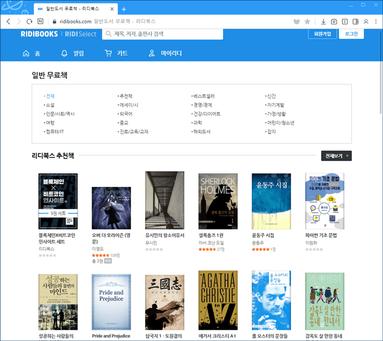

# 소프트웨어 공학-도서 추천 시스템

0325. 10 a.m 회의

- [ ]  메일(팀, 깃 주소)
- [ ]  팀 이름 (윤다인, 이상화, 좌민주, 이보림, 김희민, 국태림) → 사이트 이름 (~~yes25+~~) ~~고장난 지니~~
- [ ]  gojangnan aladin, 팀장 상화? ~? GOOD!
- [ ]  Problem Statement (문제-*problem domain으로 3분류하기*-, 시나리오) 작성
- [ ]  프로젝트 진행 방식 무엇을 쓸 것인지 같이 포함해서 넣기:

agile(되풀이 회의일, 고객 챌린지)

3기능 fix 인증?(나도 10시 목요일? fix) 

고객 챌린지 → 3팀으로 나뉘었다면 2팀이 고객이 되어 1팀에 요구하기

sub group:

1 도서 →  다인, 태림

2 결제 → 희민, 상화

3 추천 → 민주, 보림

공유 인프라

- [ ]  SCM(산출물 관리)

- Problem Statement

    ### The problem

    (~~온라인 서점의 단점)~~

    도서 e-commerce는 사용자가 언제 어디서든 온라인을 통해 책을 구매할 수 있고 원하는 배송지에 책을 배송받는 전자 상거래 시스템입니다. 온라인 서점은 방대한 양의 책을 검색할 수 있다는 장점이 있지만, 선택지가 너무 많아 생기는 간접적인 부담감이 단점이 있습니다. 

    ~~(추천 시스템의 적용)~~

    추천 시스템은 온라인 전자 상거래에서 사용자가 선택의 시간을 아낄 수 있도록 시스템이 사용자에게 상품을 추천하는 시스텝입니다. 사용자가 도서를 추천을 받기 위해 할일은 그저 책을 서핑하면 됩니다. ~~온라인 결제방식이기 떄문에,~~ 당신은 거의 모든 상황에서 온라인 결제로 쉽게 책을 사고 서핑할 수 있습니다. 저희는 도서를 판매하는 전자 상거래에서 추천 시스템을 도입해 당신에게 방대한 책을 제공하고 더불어 책에 대한 추천도 알 수 있습니다. 

    ~~(예시)~~

    다음과 같은 사용자 인터페이스를 참고하면 어떤 느낌의 앱인지 알 수 있습니다. 

    
    

    <사용자>

    User, 명호 prof.

    > Registration / Login:

    > View Book Gallery:

    > Recommendations:

    > Add to Cart/Buy Now:

    > Online Payment:

    > Order Details:

         <admin>

    Admin-0111111

    > Login:

    > Add Books:

    > View Books:

    > View Order Details:

    > View Users:

    (상황(목적) + 행동)

    **로그인 할 때 보이는 뷰로 admin으로 가입, user로 가입이 따로 있어야 할듯?**

    ### admin은 마케터 느낌

    ### user는 유저 경험

    ### recommendation은 머신러닝.

    - Registration / Login:

        온라인 도서 e-commerce 앱을 시작하면, ~~사용자는 (그는) 상품으로 진열된 여러가지 책들을 볼 수 있다.  도서를 구경하거나 책을 사려면 계정을 만든다.~~ 가입 절차는 기본 정보를 입력해서 만든다. 사용자는 사용자의 이름과 비밀번호로 로그인한다.  성공적인 로그인과 

        View Book Gallery:

        로그인 후에, 사용자는 (그는) 온라인 상품으로 진열된 여러가지 책들을 볼 수 있습니다. 책의 표지, 가격, 책 이름을 볼 수 있습니다. 한 권의 도서 이름을 클릭하면 그 책에 대한 간략한 소개가 보여집니다. 

        Recommendations:

        사용자가 웹 사이트를 다시 방문하면 시스템에 의해 추천되어진 책 갤러리를 볼 수 있습니다. 

        Add to Cart/Buy Now:

        구매를 위해 사용자는 장바구니에 담거나 바로 구매할 수 있다. 장바구니에서 사용자는 상품을 담거나 뺄 수 있고 결제 확인 절차로 이동한다.

        Online Payment:

        신용 카드/일시불로 결제할 수 있고, 카드 번호, CVV, 카드 이름 등과 같은 모든 카드 세부 정보는 필수로 알고 있어야 한다.

        Order Details:

        사용자는 구매한 책에 대한 basic details를 볼 수 있다.

    ---

    추천 시스템에서 사용할만한 데이터를 shared ingrastructure에 고객/도서 담당이 만들어 넣는다.

    책의 가격 같은 것은 admin이 넣고, admin도 공유 인프라에 저장된 도서 데이터를 쓰는 형식. 공용 인프라에는 도서 이름과 라벨링 정도의 정보만 저장! 진짜 진짜 공동 정보. 

+) 얘깃거리

- [ ]  agile 방법 → 일주일에 1번 회의 진행한 ZOOM 인증 + 회의록 (git에)
- [ ]  고객 챌린지 → 3팀으로 나뉘었다면 2팀이 고객이 되어 1팀에 요구하기
- [ ]  4월 25일 프로젝트 위한 회의 날짜 (일주일에 1번씩, 강의 내용 듣고 요약 스터디&플젝 적용 등등) _ 에자일 방식
- [ ]  shared infrastructure-공동 인프라 만들기 (도서 목록, 라벨링)

오픈소스 생산하는게 목적. 협업, 여러 버전 관리

어떤 훈련을 거쳤는지! 거기에 woking code와 앞 부분 훈련 설명이 중요중요!

코드의 어떤 부분이 어느 requirement나 use cases를 쓰는지 추적가능해야함.

고객과 시스템 설계의 mapping을 잘하는 것***
